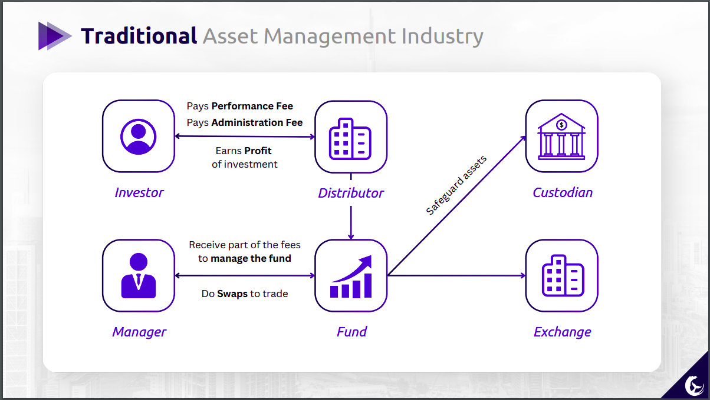
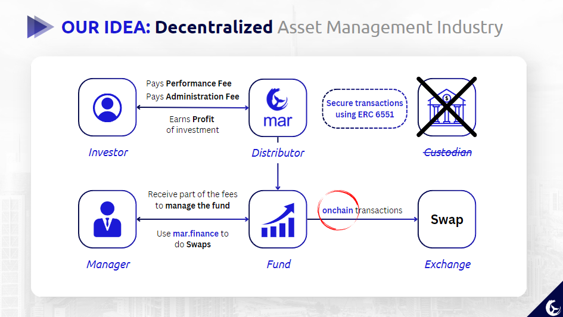
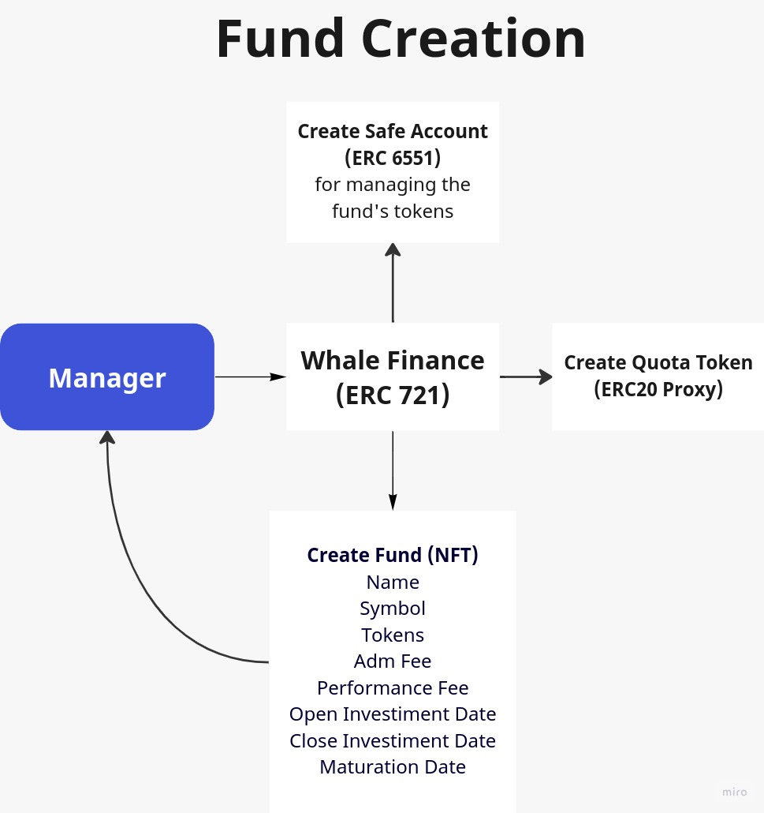

# mar.finance - HackaTRON Season 5

## Decentralized Asset Management

mar.finance basically implements Decentralized Asset Management with ERC 6551. We want to give the opportunity to investors sees their money been managed with full security and auditability.

## The Idea

> "The idea came from our own experience with the fund industry, both of us on the team have already/still interned at investment funds, in the normal asset analysis part. Crypto is not yet so widespread in Brazil, despite the growing expansion, and we saw the potential to decentralize the entire investment process in funds using smart contract technologies, like the ERC 6551. Thus arose mar.finance."

This project uses ERC 6551 to allow managers to hold assets from investors. In this way, we can basically make a descentralized asset management using EVM. The platform is designed for the two publics: The investors, who will be able to invest their tokens in really great funds around the work in a safe way, and the managers, who will be able to manage and hold investor tokens and can have a profit to themselves.

___

### Traditional

Before that, to give some context, the stakeholders of the financial market explained:

- Distributor: Markets and sells financial products to investors.

- Exchange: Platform for buying and selling financial assets.

- Custodian: Safeguards and manages financial assets.

- Fund: Pooled investment vehicle managed professionally.

These bullet points below describes the flow over a fund invesment in the traditional financial market, with 6 main stakeholders:

- **Investor & Fund:** To have a share in the fund, the investor must pay a management fee to the manager, and a performance fee equivalent to a percentage above the market benchmark. In this way, the manager aligns with the investment by earning these fees for managing the fund.

- **Distributor & Fund:** The distributor acts as a bridge between the fund and potential investors, marketing and selling the fund's financial products. Through collaborations and agreements, distributors help expand the fund's reach and increase its assets under management, enhancing the fund's visibility and accessibility.

- **Exchange & Fund:** Exchanges serve as vital platforms where funds can actively participate in trading activities, acquiring or disposing of assets as per their investment strategies. They facilitate a transparent environment where funds can execute trades based on real-time market conditions, thus helping in the price discovery process and achieving investment objectives.

- **Custodian & Fund:** Custodians play a pivotal role in safeguarding the assets of the fund, ensuring that they are held securely and are not susceptible to theft or loss. Apart from asset safekeeping, they also assist in transaction settlements and administrative services, thus ensuring smooth operational flow and compliance with regulatory requirements.



___

### Decentralized

Benefits to decentralize the asset management industry and differences from the traditional flow:

- **Innovation:** There are no solutions (or few) that implements a full descentralized flow in the asset management industry (only crypto funds represents more than 1 billion dollars, but the solution can be extended to other markets), primordialy because the recent creation of ERC 6551 that can allow better the action of hold assets

- **Autonomy and Control:** Investors and managers have more control over their assets and investments, without the influence or interference of centralized entities (that is one of the strongest principles to buy crypto today).

- **Cost-Effectiveness:** By eliminating intermediaries (like the custodian), the platform can potentially reduce the costs associated with asset management, including fees that would normally be paid to distributors and custodians.

- **Transparency:** Utilizing a decentralized platform ensures that all transactions and fund performances are recorded on a transparent and immutable ledger, which can increase trust among investors.

- **Security:** Our main idead behind mar.finance, the use of ERC 6551 secures the way that manager can hold and manage assets from investors.

- **Profit Opportunities for Managers:** The platform creates opportunities for managers to profit by offering their expertise to a wider audience, the performance is transparent and the mechanism to hold assets is secure.

- **Regulatory Compliance:** The use of smart contracts can automate compliance with regulatory requirements.

- **Integration and Potential:** The mar.finance is integrated with **Zeniq Swap**, and can be integrated in the future with other products, like Zeniq Pass. Besides that, there is a lot of potential to explore 



## User Roles

### Investors

Features:

- **Funds List:** Can choose a fund in a list of funds to make an investment _(/fundslist route)_
- **Invest:** Can see stats about the fund chosen, like a performance chart, and then invest in the favorite ones _(/funds/id route)_
- **Dashboard:** Can see stats and metrics about your investments _(/investor route)_ + _(pivoted: not implement in the hackathon)_

### Managers

Features:

- **Create a fund:** Can create a fund based on the parameters listed below in the Fund section  _(/ route)_
- **Funds List:** Can choose a fund in a list of funds to see stats about the managed fund _(/manager route)_
- **Dashboard:** Can see stats about the fund chosen and then swap tokens to operate the fund _(/manager/id route)_

### Fund

The main parameters to create a fund:

- **Name:** The official title of the fund, used for recognition and branding.
- **Ticker:** A unique series of letters representing the fund in the stock market, used for quick identification.
- **Account:** The designated account for managing the fund's financial transactions and maintaining records.
- **Tokens:** Digital assets within the fund that can represent shares or other assets, facilitating flexible transactions.
- **Administration Fee:** A charge levied to cover the fund's operational costs, maintaining its viability.
- **Performance Fee:** A fee charged based on the fund's performance, serving as an incentive for fund managers.
- **Open Investment:** The time frame during which investments can be made into the fund, helping to manage the inflow of capital.
- **Close Investment:** The period indicating when the fund stops accepting new investments, assisting in portfolio stability.
- **Maturation Time:** The projected time frame for the fund to reach its investment goals, guiding investors on expected returns.

## How it Works

- A concise overview of the technical workings of the platform.
- The role of ERC 6551 and EVM in facilitating decentralized asset management.




### Technology

- Frontend: We used typescrit + tailwind css + vite.js to deploy more fast and be adjusted to our web3 project, that does not have backend
- Contracts: We use ERC 6551 to allow managers to control assets from investor at the same time that the assets are safe in a different address.
  
This ERC allows an nft owner to have control over an account, but with customizable features, such as limitations to the possible transactions made. The marFinance contract implements the ERC721 tokens (NFT) and creates the controllable addresses, which we call Safe Accounts. Also, every fund has a quota (or share), which is an ERC20 token, also deployed when the NFT is created. With these features, the investors are able to invest with a stablecoin (say ZUSD) and get 1:1 quotas in exchange.

When the fund is open to trades, the manager can interact with Zeniq Swap to make profits, using the assets available in the Safe Account. After maturation time, the investor can redeem their yields, with profits or loss. 

### Folder Structure

Here is the folder structure of the project with comments about files:

    .
    ├── README.md                                        
    ├── presentation/                                    # Directory where the presentation is
    ├── frontend/                                        # Directory for frontend using Typescript + Tailwind CSS + Vite JS
    │     └── src/                                       
    │          ├── App.tsx                               # Main application component
    │          ├── assets/                               
    │          ├── components/                          
    │          │      ├── ConnectWallet/                 # Component to facilitate wallet connection
    │          │      ├── DataDiv/                       # Component for data about fund
    │          │      ├── Footer/                        
    │          │      ├── FormInvestor/                  # Form component for investor details
    │          │      ├── FormManager/                   # Form component for manager details
    │          │      ├── FormSwap/                      # Component for swap functionality
    │          │      ├── Header/                        
    │          │      ├── LineChartComponent/            # Component to display line charts (lib Recharts)
    │          │      └── PieChartComponent/             # Component to display pie charts (lib Recharts)
    │          ├── contracts/                            
    │          │      ├── QuotaToken.ts                  # Quota token contract file
    │          │      ├── SafeAccount.ts                 # Safe account contract file
    │          │      └── marFinance.ts                # marFinance contract file
    │          ├── firebase/                             
    │          │      ├── test_database.json             # json with mock data to test database in firebase
    │          ├── pages/                                
    │          │      ├── CreateFund/                    # Manager: Page for creating a fund
    │          │      ├── DashboardId/                   # Manager: Dashboard of specific fund, here the manager can **swap tokens**
    │          │      ├── FundId/                        # Investor: Fund page with stats and **invest action**
    │          │      ├── FundsList/                     # Investor: List of funds presented in the platform
    │          │      ├── Home/                          # Home page
    │          │      ├── Investor/                      # Investor: Dashboard showing investments and stats
    │          │      ├── Layout/                        # Layout page to incorporate header in the app
    │          │      ├── Manager/                       # Manager: Funds list of funds managed by the manager
    │          │      ├── SuccessFund/                   # Page component to display fund creation success
    │          │      └── SuccessInvestment/             # Page component to display investment success
    │          └── utils/                                
    │                ├── addresses.ts                    # File containing contract addresses
    │                └── connectMetamask.ts              # Utility file to facilitate Metamask connection
    │
    └── whale-finance/                                   # Directory for smart contracts
          └── src/
          │     ├── Counter.sol                          # Counter smart contract file
          │     ├── ERC6551Registry.sol                  # ERC6551 Registry contract file
          │     ├── MockERC20.sol                        # Mock ERC20 contract file for testing
          │     ├── QuotaBeacon.sol                      # Quota Beacon contract file
          │     ├── QuotaToken.sol                       # Quota Token contract file
          │     ├── SafeAccount.sol                      # Safe Account contract file
          │     ├── marFinance.sol                     # Main marFinance contract file
          │     └── interface/                            
          │           ├── IERC6551Account.sol            # Interface file for ERC6551 Account
          │           ├── IERC6551Registry.sol           # Interface file for ERC6551 Registry
          │           └── IV2SwapRouter.sol              # Interface file for Uniswap V2 Swap Router
          └── test/
                └── WhaleFinance.t.sol                   # Test file for marFinance contract


Deployed Contracts (in Zeniq):

Beacon Quota Implementation: 0xB6e2Fb3360F76a51a0AF8A4F86aE5194ae145c6b

ZUSD: 0xA3f156324feCc5ED3A8495C2399666a598A73ee4

Registry ERC6551: 0x16C71580A4D79d6bE3413F5226125Efb5630D669

Beacon Proxy: 0xcBb864E7Af870F000F7b88eeD508Bc0392E2BE94

Safe Account (implements ERC6551): 0x83988Eb399460dD07f9e37628bC61a47dc094113

mar Finance: 0xE7fB04eA857F9F96939fc98bD17Ff88ce8b0AdF0

## Implemented Solution

### Demo

[Demo Link](https://www.loom.com/share/6913cf323b4644cfbcb3133377d3ca2c?sid=17cfc3fb-4d68-4b81-a225-4d8d25e18772)

### Deploy

[Deploy Link](https://whale-finance.vercel.app/)

### How to run locally steps

You need to run in the frontend:

```
npm install
```

The second step is to use the json file with keys and the .env keys of firebase to run and integrate with firebase the project:

json file in frontend/src/firebase and the .end in the root folder of frontend/ to connect with my firebase access

Then run the project with:

```
npm run dev
```


## Team

Bryan Borck (developer/designer)

Luiz Vasconcelos (blockchain developer)

